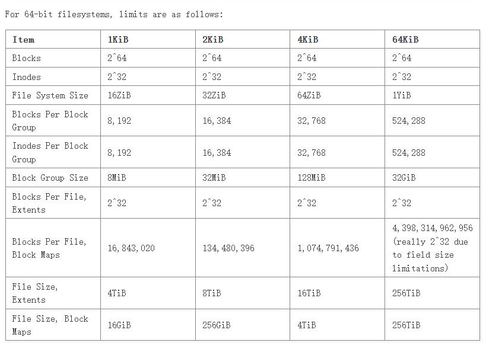
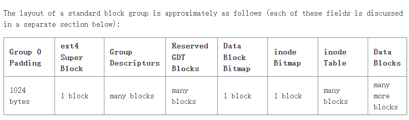
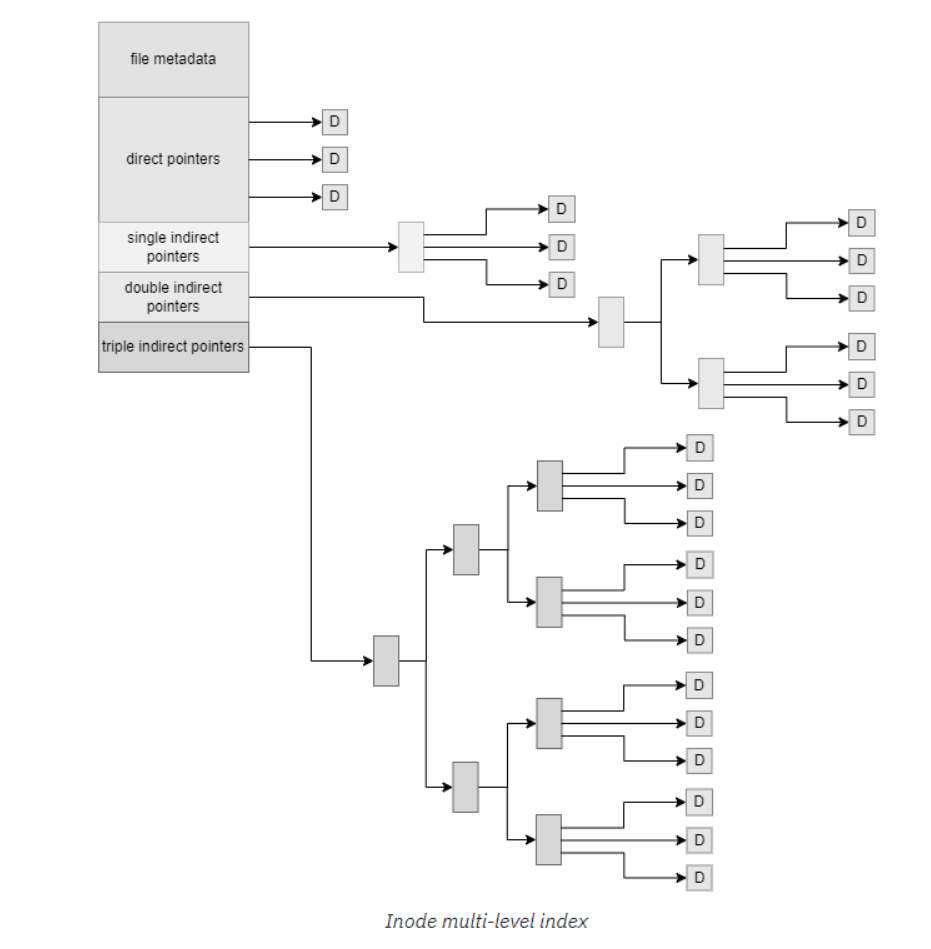
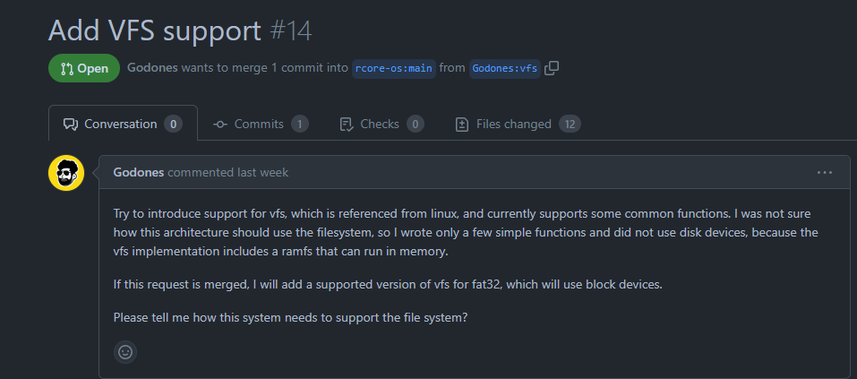

 

# ext4 文件系统 调研汇报

#### 2023 春 OS 大实验交流

 

**高焕昂** 计04
2020010951
gha20@mails.tsinghua.edu.cn

2023/4/2

---

## 上周主要工作

- 调研 ext4 文件系统的定义与设计
- 调研 ext4 文件系统的实现（Rust 版本与其他语言版本）
- ArceOS 组件化操作系统 Hello World

---

## `ext4` Filesystem: Introduction

- `ext4` is a journaling file system developed as an improvement over ext3. It is the *default file system for many popular Linux distributions*. It provides better performance and reliability than its predecessor.

- The [Linux kernel documentation](https://www.kernel.org/doc/html/latest/filesystems/ext4/index.html) provides a detailed description of ext4’s data structures and algorithms. :)

- We can also refer to [this link](https://www.kernel.org/doc/html/v4.19/filesystems/ext4/index.html) for information about general usage and on-disk artifacts written by `ext4`. A wiki site is also available [here](https://ext4.wiki.kernel.org/index.php/Ext4_Howto).

---

## `ext4` Filesystem: Design > Blocks

- `ext4` allocates storage space in units of “blocks”, and the filesystem is split into a series of block groups. 

---

## `ext4` Filesystem: Design > Layout

---

## `ext4` Filesystem: Design > Layout

+ *Group 0* Padding: to allow for the installation of x86 boot sectors and other oddities.
+ Super Block: The superblock records various information about the enclosing filesystem, such as block counts, inode counts, supported features...
    + We need redundancy to better protect the superblock. If the *sparse_super* feature flag is set, redundant copies of the superblock and group descriptors are kept only in the groups whose group number is either 0 or a power of 3, 5, or 7. If the flag is not set, redundant copies are kept in all groups.

---

## `ext4` Filesystem: Design > Layout

+ Group Descriptors: Each block group on the filesystem has one of these descriptors associated with it.
    + The group descriptor records the location of both bitmaps and the inode table.
    + Two mechanisms: *flex_bg* and *meta_bg*.
        + The *flex_bg* mechanism groups several block groups into a flex group and lay out *all of the groups’ bitmaps and inode tables into one long run* in the first group of the flex group.
        + The *meta_bg* mechanism enforces that *only* the first and last two *block groups* within the larger meta group *contains group descriptors* for the groups inside the meta group.

---

## `ext4` Filesystem: Design > Layout

+ Block and inode Bitmaps: The *data block bitmap* tracks the usage of *data blocks* within the block group. The *inode bitmap* records which *entries* in the inode table are in use.

+ Inode Table: The inode table contains the *inode* structures for all the files and directories in the block group.

+ Data Blocks: The data blocks are used to store the actual file data.

---

## `ext4` Filesystem: Design > Inode Table Entries

+ Either represent a file or a directory.

---

## `ext4` Filesystem: Design > Directory Entries

+ In an `ext4` filesystem, a directory is more or less a flat file that maps an arbitrary byte string (usually ASCII) to an inode number on the filesystem.
    + Linear (Classic) Directories
    + Hash Tree Directories: Use B-Trees to store directory entries.

---

## ext4 文件系统：实现

+ Read files directly from ext4 filesystem images: https://github.com/FauxFaux/ext4-rs

+ Standard ext4 filesystem implementation in Linux (written in C): https://github.com/torvalds/linux/tree/master/fs/ext4

---

## AcreOS 组件化操作系统

+ 和助教学长交流后等待 `fs` 的重构，之后再开始实现 :)

---

## 下周计划

+ 仔细阅读 `ext4` 文件系统的实现 Code

+ 如果 fs 已经并入 ArceOS，那么就开始上手实现 ext4 文件系统的数据结构与相关算法 :)